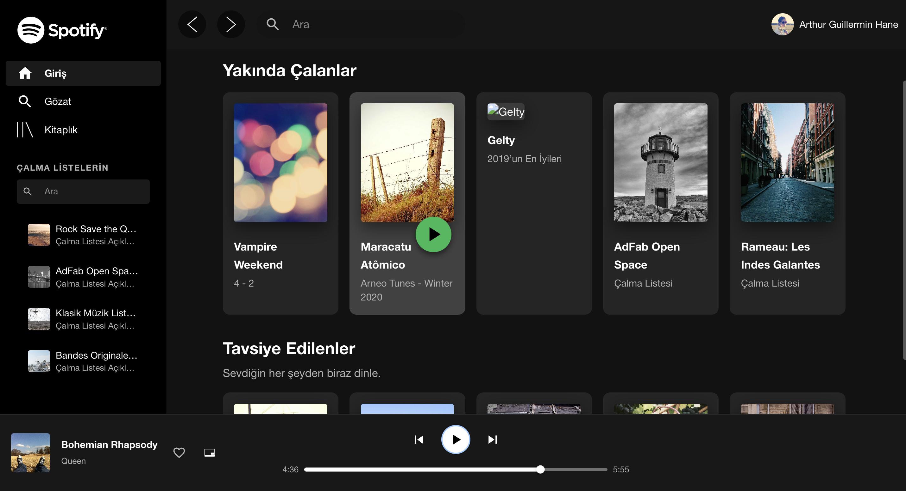

# Spotify Clone

This project is a clone of the Spotify web player, built with React.js and Material UI. It allows users to browse playlists and albums, see recently played tracks, and view recommended content, mimicking the core user experience of Spotify.



## ✨ Features

- **Browse Content:** View "Yakında Çalanlar" (Recently Played) and "Tavsiye Edilenler" (Recommended) sections.
- **Playlist & Album Listing:** Display playlists and albums with cover art and descriptions.
- **Search Functionality:** (To be implemented) Search for tracks, artists, and playlists.
- **Music Player UI:** A static UI for the music player showing the current track, playback controls, and volume.
- **Responsive Design:** The layout is designed to be responsive and adapt to different screen sizes.

## 🛠️ Tech Stack

- **Frontend:**
  - [React.js](https://reactjs.org/) (with [Vite](https://vitejs.dev/))
  - [Material UI (MUI) v5+](https://mui.com/)
  - [Redux Toolkit](https://redux-toolkit.js.org/) for state management
  - [Redux Thunk](https://github.com/reduxjs/redux-thunk) for asynchronous actions
- **HTTP Client:**
  - [Axios](https://axios-http.com/) for making API requests
- **Linting & Formatting:**
  - [ESLint](https://eslint.org/)

## 🚀 Getting Started

Follow these instructions to get a copy of the project up and running on your local machine for development and testing purposes.

### Prerequisites

You need to have [Node.js](https://nodejs.org/en/) and [npm](https://www.npmjs.com/) (or [yarn](https://yarnpkg.com/)) installed on your system.

### Installation

1.  **Clone the repository:**
    ```bash
    git clone https://github.com/ahmethakanyldrm/spotify-clone.git
    cd spotify-clone
    ```

2.  **Install dependencies:**
    ```bash
    npm install
    ```

3.  **Run the development server:**
    ```bash
    npm run dev
    ```

The application will be available at `http://localhost:5173` (or another port if 5173 is busy).


## 🌐 API

This project uses a static JSON file as a mock API to fetch data for playlists, albums, and recommendations.
- **API Endpoint:** `/{base_url}/spotify.json`
